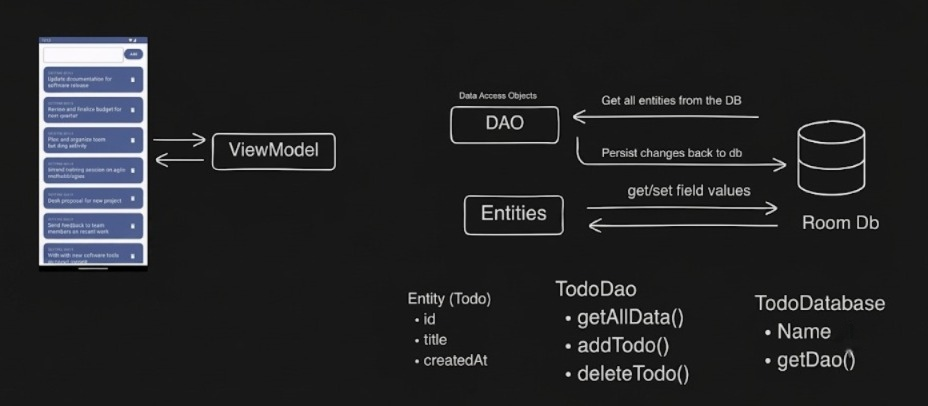

# 📝 TodoList Room Database

A modern Todo List Android application built using **Kotlin**, **Jetpack Compose**, **MVVM Architecture**, **LiveData**, and **Room Database**.

The application allows users to add, view, and delete tasks while storing all data locally using Room.

---

## ✨ Features

- ✅ Add new todos
- 🗑️ Delete existing todos
- 💾 Offline local storage using Room Database
- 📅 Save task creation date
- 🔄 Automatic UI updates using LiveData
- 🏗️ MVVM Architecture
- 🎨 Modern UI built with Jetpack Compose

---

## 🛠️ Tech Stack

- Kotlin
- Jetpack Compose
- MVVM
- Room Database
- LiveData
- Coroutines

---

## 📂 Project Structure

```
MainActivity
      │
      ▼
TodoViewModel
      │
      ▼
TodoDao
      │
      ▼
Room Database
      │
      ▼
Entity (Todo)
```

---

## 📸 Architecture




---

## 🚀 Getting Started

1. Clone the repository

```bash
git clone https://github.com/Gavy2006/TodoList_RoomDb.git
```

2. Open in Android Studio

3. Sync Gradle

4. Run the application

---

## 📚 Learning Concepts

- Room Database
- DAO
- Entity
- TypeConverter
- MVVM
- LiveData
- ViewModel
- Coroutines
- Jetpack Compose

---

## 👨‍💻 Author

**Gavy**

GitHub:
https://github.com/Gavy2006
